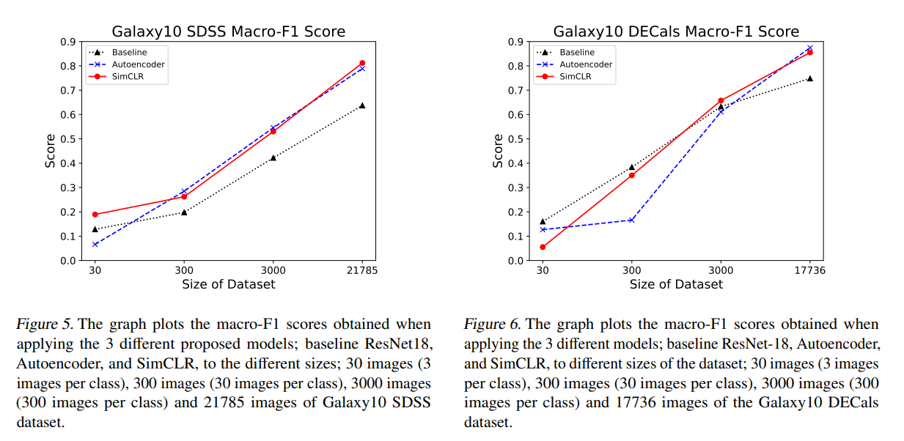

# Cross-Survey Galaxy Morphology Classification

## What is this?

Python code for classifying galaxies according to their morphology in a self-supervised manner. This code implements the machine learning pipeline we proposed in [Self-Supervised Learning for Cross-Survey Galaxy Morphology Classification](https://github.com/JunhuaL/MLP_G036/blob/main/Final_Report.pdf).

## Why combine galaxy morphology classification with self-supervised learning?

Galaxy morphology classification has historically been hampered by issues of label quality. Self-supervised learning,Self-supervised learning allows the model to learn the underlying patterns in the data without using the labels.

## Performance Insight

As shown in the figure below, both of our proposed methods boost performance when trained using all existing labeled data. The best-performing method increases accuracy by 9% compared to the fully supervised counterpart.

  

